# ChBrowser AI エージェント 設計資料

> **この文書の位置づけ**
> ChBrowser 内蔵 AI エージェントの「現状 (As-Is)」と「目標とする 3 レイヤー構成 (To-Be)」をまとめた設計資料 兼 解説資料。
> 図はすべて Mermaid。GitHub / VS Code (Markdown Preview Mermaid Support 等) でそのまま描画できる。
>
> - **ステータス**: 構築方針確定 (2026-05-23)。既存エンジンと並走する新エンジンをゼロから構築し、実行時に切替える方針。詳細は §4「決定事項」。
> - **対象読者**: 本リポジトリの開発者 (= 自分) と、将来の自分への引き継ぎ
> - **関連コード**: `src/ChBrowser/ViewModels/AiChatViewModel.cs` / `Services/Llm/*`

---

## 目次

1. [現状アーキテクチャ (As-Is)](#1-現状アーキテクチャ-as-is)
2. [目標アーキテクチャ (To-Be): 3 レイヤー](#2-目標アーキテクチャ-to-be-3-レイヤー)
3. [現状ハックがどう解消されるか](#3-現状ハックがどう解消されるか)
4. [決定事項 (Decisions)](#4-決定事項-decisions)
5. [エンジン差し替えの seam](#5-エンジン差し替えの-seam)
6. [設定スキーマ](#6-設定スキーマ)
7. [構築方針 (並走 + 切替)](#7-構築方針-並走--切替)

---

## 1. 現状アーキテクチャ (As-Is)

### 1.1 構成要素と関係性

エージェントは **1 つの `while(true)` ループ** (`AiChatViewModel.SendAsync`) にすべての制御が集約されている。
plan・estimate・タスク完了・レビュー・ツール実行が同一ループ・同一会話履歴 (`_history`) 上で動く。

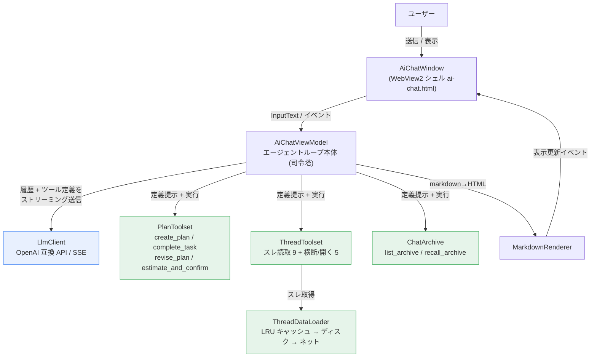

| 要素 | ファイル | 役割 |
|---|---|---|
| AiChatViewModel | `ViewModels/AiChatViewModel.cs` | エージェントループ本体。1 ユーザ送信 = 1 バブルで何ラウンドでも回す |
| LlmClient | `Services/Llm/LlmClient.cs` | OpenAI 互換 API への SSE ストリーミング |
| PlanToolset | `Services/Llm/PlanToolset.cs` | 計画の作成 / 完了 / 修正 / コスト見積 |
| ThreadToolset | `Services/Llm/ThreadToolset.cs` | スレ読み取り・板/スレ横断・アプリ操作 |
| ChatArchive | `Services/Llm/ChatArchive.cs` | 会話内の全出来事を保管し原文を引き戻す |
| ThreadDataLoader | `Services/Llm/ThreadDataLoader.cs` | スレデータのキャッシュ/ディスク/ネット取得 |

### 1.2 エージェントループの流れ

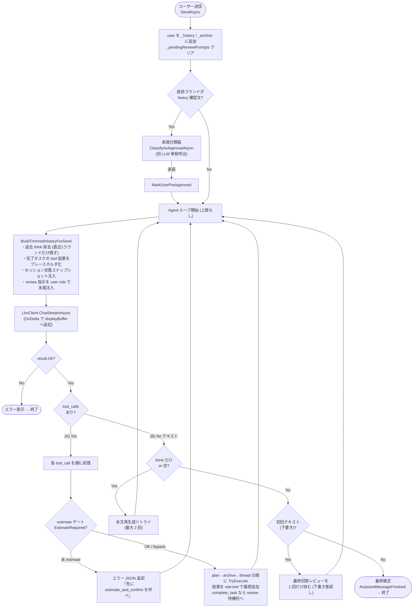

### 1.3 3 つの強制チェックポイント

現状の「挙動制御の肝」。AI を望む方向へ矯正するために 3 つのゲートが仕込まれている。

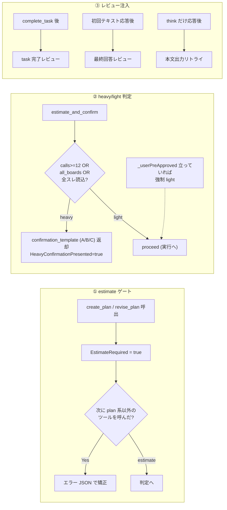

### 1.4 コンテキスト肥大化対策 (現状のハック)

`while(true)` が全部 1 つの履歴を共有しているため、毎ラウンド `BuildTrimmedHistoryForSend` で送信ペイロードを削っている。

- **過去 `<think>` 削除** — 直近 1 ラウンドの assistant だけ思考を残し、他は除去
- **完了タスクの tool 結果をプレースホルダ化** — 要点は `plan.finding` に、原文は `recall_archive` で引ける旨を注記
- **セッション状態スナップショット** — plan 全タスク + archive 目録 (上位 30) を system 直後に毎回再注入

### 1.5 現状の課題

| # | 課題 | 症状 |
|---|---|---|
| 1 | コンテキスト肥大化 | 生の tool 出力 (スレ本文数百レス) も plan も review も同一履歴。trim で後追い対処 |
| 2 | 強制チェックポイントが多い | estimate + task完了レビュー + 最終回答レビューで API 往復が増える |
| 3 | reasoning モデル対策の継ぎ接ぎ | think-only リトライ / 承諾分類器など |
| 4 | エラー自己修復が弱い | ツールがエラー JSON を返したときのリカバリが運任せ |
| 5 | 単一巨大クラス | `AiChatViewModel` 1000 行に制御が集中、テスト困難 |

---

## 2. 目標アーキテクチャ (To-Be): 3 レイヤー

### 2.1 基本思想 — コンテキスト隔離

**各レイヤーは自分に必要な context しか持たない。**
生の tool 出力は最下層のスコープ内で生まれて死に、上層には要約 (finding) だけを返す。
これにより 1.4 のハックが「後から削る」のではなく「そもそも持たない」構造になる。

### 2.2 レイヤー構成と責務

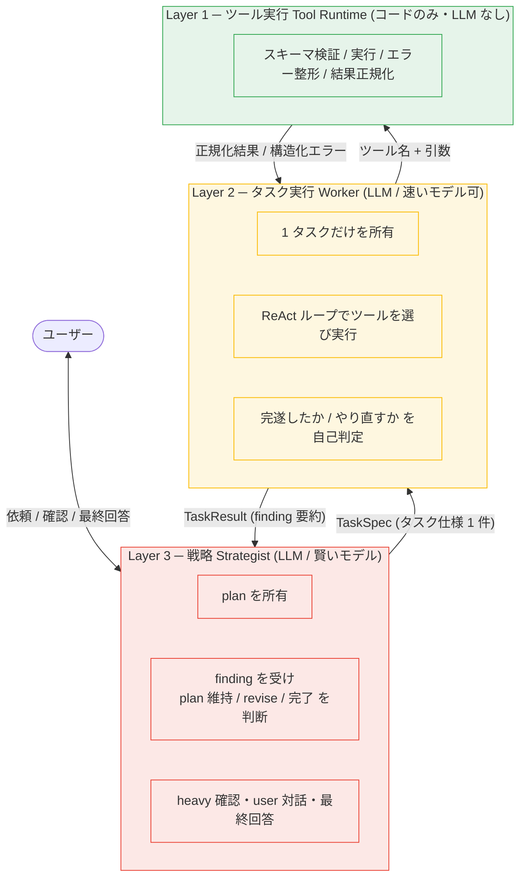

| 層 | 名前 | 主体 | 責務 | 持つ context |
|---|---|---|---|---|
| L3 | 戦略 Strategist | LLM (賢いモデル) | plan 所有・user 対話・finding を見て維持/revise・heavy 確認・最終回答 | 依頼 + plan + 各タスクの finding (要約のみ) |
| L2 | タスク実行 Worker | LLM (速いモデル可) | 1 タスクを完遂・ReAct でツール選択・完遂/やり直し判定 | タスク仕様 + そのタスク内の tool 往復のみ (タスク後に破棄) |
| L1 | ツール実行 Tool Runtime | コードのみ | スキーマ検証・実行・エラー整形・結果正規化 | なし (ステートレス) |

> **設計上の肝**: Layer 1 は **LLM を持たない純粋ランタイム** (現 `DispatchToolAsync` を昇格させたもの)。
> 「結果を見てまた呼ぶ」ReAct ループの**判断主体は Layer 2 (Worker)** に置く。
> こうすると「タスクを完遂したか」の判定 = Worker の責務に一本化され、各層が単一責務になる。

### 2.3 層間コントラクト

最初に固めるべき API。生の tool 出力が **Worker のスコープを超えない** のが要点。

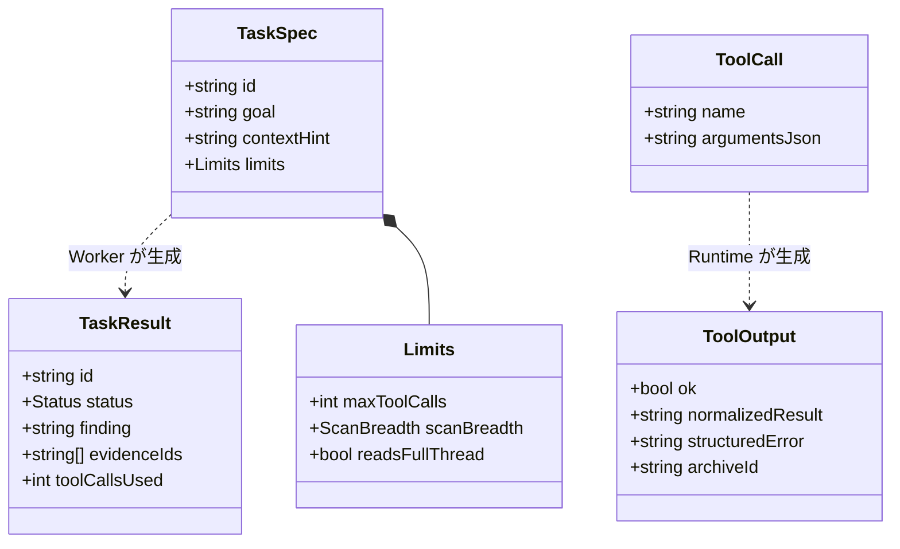

各フィールドの意味 (具体は D12 / §4.7 で確定):

- `TaskSpec.limits` … `maxToolCalls` (Worker のツール予算 = ハード上限) / `scanBreadth` (`single`/`few`/`many`/`all_boards`) / `readsFullThread`
- `TaskSpec.contextHint` … タスクを解くための文脈ヒント (Strategist が前タスクの finding 抜粋などを詰める)
- `TaskResult.status` … `done` / `partial` / `failed`
- `TaskResult.finding` … 要約 3 文程度
- `TaskResult.evidenceIds` … 原文を引くための archive id 群
- `ToolOutput` … 成功時は `normalizedResult` + `archiveId` (L1 が記録)、失敗時は `structuredError`

層間のやり取り:

- **Strategist → Worker** (下向き): `TaskSpec { id, goal, contextHint, limits }`
- **Worker → Strategist** (上向き): `TaskResult { id, status, finding, evidenceIds(archive id), toolCallsUsed }`
- **Worker → Runtime**: `ToolCall { name, args }`
- **Runtime → Worker**: `ToolOutput { ok, 正規化結果 + archiveId | 構造化エラー }`

Strategist には要約 (finding) と「原文が要るなら archive id でこのキーを引け」という参照だけ渡す。

### 2.4 タスク実行のシーケンス

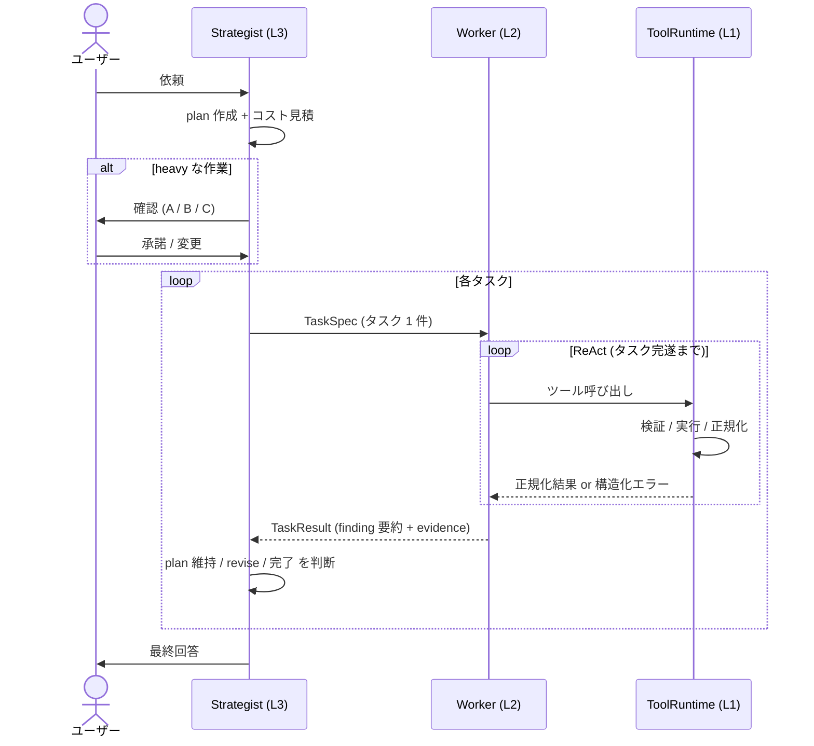

### 2.5 戦略レイヤの状態遷移

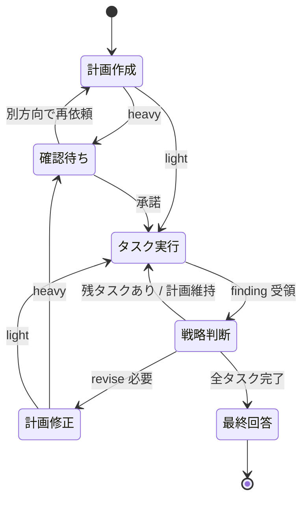

> heavy 判定は独立した「コスト見積」ステップではなく、`create_plan` / `revise_plan` の結果に畳み込まれる (D11)。
> 判定は累積コミット予算で行う (§4.6)。

### 2.6 単純依頼の fast-path

すべてを 3 段通すと単純依頼で API 往復が無駄に増える。
**1 タスクで済む / 指示が明確**な依頼は Strategist を省略し Worker 直行する経路を用意する。

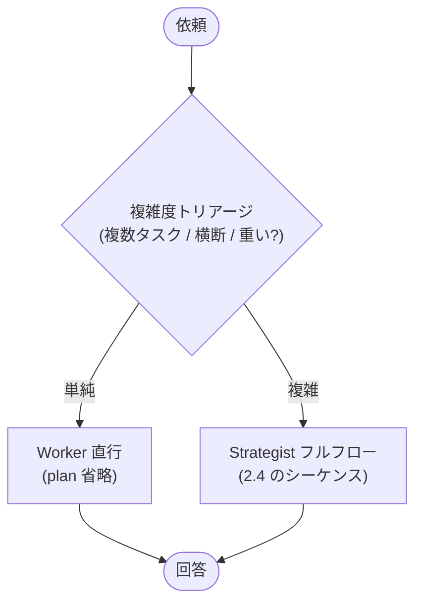

> **決定 (D3)**: このトリアージは独立した LLM 往復を作らず、**Strategist の初手ターンに内包**する
> (初手で「plan を作る/単一タスク直委譲」を選ばせる)。詳細は §4.2。

---

## 3. 現状ハックがどう解消されるか

| 現状 (As-Is) | 3 レイヤー化後 (To-Be) |
|---|---|
| `BuildTrimmedHistoryForSend` の think 除去 / プレースホルダ化 | **不要** — 生出力は Worker スコープで死ぬ |
| セッション状態スナップショット毎ラウンド注入 | **不要** — Strategist は元々 plan + finding しか持たない |
| review プロンプトの user role 注入 (task完了 / 最終回答) | **Strategist の通常ターン**になる (注入ではなく層の役割) |
| estimate ゲート (`EstimateRequired` ガード) | **Strategist の plan 確定ステップ**に統合 |
| heavy 確認 + 承諾分類器 `ClassifyAsApprovalAsync` | Strategist が user と対話する自然な流れに吸収 |
| think-only リトライ | 各層のローカル責務に縮小 |
| 単一巨大 `AiChatViewModel` | Strategist / Worker / ToolRuntime の 3 クラスに分割 |

### トレードオフ (注意点)

1. **LLM 呼び出し回数が増えうる** — Strategist と Worker が別ターンになるため。ただし各呼び出しの context が激減するので**総トークンはむしろ減る**ことが多い。fast-path で単純依頼を救う。
2. **層をまたぐ状態の置き場** — plan / finding は Strategist、archive は全層共有 (id 参照) が素直。
3. **UX (ストリーミング表示)** — 「Strategist の語り = 表向き本文」「Worker の作業ログ = 折りたたみ区画」にマッピング (D4 / D14)。`<tool-call>` マーカーは流用するが、`agentFinalBoundary` の**投機 + 巻き戻しは廃止**し、最初の `StreamBody` で境界を確定する (D14 / §4.9)。

---

## 4. 決定事項 (Decisions)

> 2026-05-23 に下記を確定。資料前半 (§1–§3) の設計思想 (3 レイヤー / コンテキスト隔離) はそのまま、
> **構築の進め方を「段階リファクタ」から「既存と並走する新エンジンをゼロから作り、実行時に切替」へ変更**した。

### 4.1 基本方針

- **ツール (L1 相当) は既存を流用** — ただし一律ではない:
  - `ThreadToolset` の読み取り系と `ChatArchive` (`recall_archive`) は**ツール定義ごとそのまま流用**。
  - **plan まわりは別扱い** — D10 / D11 で `estimate_and_confirm` 廃止・`complete_task` 廃止/再定義・`dispatch_task` 新設のため、Strategist 用のツール定義は**新設**する。`PlanToolset` からは plan データ構造と置換 / マージのロジックのみ再利用 (= `GetToolDefinitions()` はそのまま提示しない)。
- **Agent 本体はゼロから新規構築** — 既存ループを改造せず、別実装を新設する。
- **完成まで既存 ⇄ 新を実行時切替** — 設定トグルでどちらのエンジンを使うか選べる。新エンジンが完成・検証されるまで既定は既存。
- **新エンジンは実装難易度を問わず機能ベストで設計** — 並列実行・2 モデル構成などを最初から組み込む。

### 4.2 確定した論点

| # | 論点 | 決定 | 補足 |
|---|---|---|---|
| D1 | Layer 1 の定義 | **(a) LLM なし純粋ランタイム** | 新エンジン用に L1 を新規実装 (検証・実行・正規化・archive 記録・id 返却)。estimate ゲートは L1 に入れず L3 ポリシーへ。既存の `DispatchToolAsync` は温存 (並走のため干渉しない)。 |
| D2 | Worker の実装 | **(b) 毎タスク使い捨て sub-agent** | タスクごとに新鮮な context (system + TaskSpec + そのタスクの往復のみ)。終了で破棄。trim ハックが原理的に不要になる。 |
| D3 | fast-path | **Strategist 初手に内包** | 専用トリアージ往復は作らない。Strategist の初手で「plan を作る (複雑) / 単一タスク直委譲 (単純)」を選ばせて fast-path を実現。§2.6 のトリアージはこの形に具体化。 |
| D4 | バブル所有権 / UI | **`IAgentHost` + タスク区画** | エンジンは「本文 (Strategist の語り) / 作業ログ (Worker)」の二系統を host に流すだけ。作業ログはタスク単位の折りたたみ区画に分け、並列実行でもログが混ざらない。 |
| D5 | archive 記録の seam | **L1 が記録し id を返す** | 生の tool 出力は L1 で archive に格納、上層へは正規化結果 + archive id のみ返す。生出力が Worker の往復にすら長居しない。 |
| D6 | キャンセル伝播 | **CancellationToken 貫通** | `IAgentEngine.RunTurnAsync` が ct を受け、Worker 子会話・ツール I/O まで伝播。ウィンドウ閉/中断で全停止。 |
| D7 | モデル構成 | **2 接続を設定で持つ + 並列トグル** | Strategist 接続 / Worker 接続をそれぞれフルセット (URL/Key/Model/Context) で設定可能。並列実行は ON/OFF をユーザが選ぶ (§6)。 |
| D8 | 状態保持の粒度 | **finding / Strategist はセッション持続・plan はリクエスト単位** | ターンを跨ぐ追記対話のため finding と Strategist 会話は持続。生出力は archive (id) に逃げるので持続しても肥大しない。長セッションは「現 plan + 直近 N ターン」をライブに、古い finding は archive 送り。詳細 §4.3。 |
| D9 | リトライ戦略 | **2 段リトライ (Worker 戦術 / Strategist 戦略)** | Worker は ReAct 内で自己修正 (予算/ステップ上限で停止、done 以外は finding に理由)。Strategist は finding を読んで TaskSpec を作り直して再委譲 (同一再送禁止・1 タスク既定 2 回上限)。詳細 §4.4。 |
| D10 | 各層の駆動方式 | **両層とも tool-call 方式・Worker を `dispatch_task` ツールとして Strategist に露出** | 既存 `LlmClient` + ツール群を再利用。Strategist の `dispatch_task` 1 呼び = Worker ReAct サブループ 1 本 (finding だけ返る)。生 tool 出力は Worker 内で死ぬ。詳細 §4.5。 |
| D11 | heavy 確認フロー | **承諾分類器・estimate ツールを廃止／heavy は累積コミット予算から engine 算出** | 永続 Strategist 会話 (D8) が承諾解釈を吸収。`create_plan`/`revise_plan` の結果＋ad-hoc dispatch の累積予算に light/heavy を畳み込み、heavy 未確認なら `dispatch_task` を決定論ゲートでブロック。A/B/C は Strategist が `ask_user` で構成。詳細 §4.6。 |
| D12 | `limits` / 層間コントラクト | **`limits = { maxToolCalls, scanBreadth, readsFullThread }` に確定** | `maxToolCalls` は決定論キャップ (旧自己申告を格上げ)、他 2 つは heavy 判定の記述子。heavy は per-タスク limits の集計 (Σ≥12 / all_boards / full-thread)。`TaskSpec`/`TaskResult`/`ToolOutput` を確定 (§2.3 更新)。詳細 §4.7。 |
| D13 | plan ライフサイクル / 新規検出 | **検出器なし・ツール選択が意図表明／plan 置換 ≠ 記憶消去** | `create_plan`=置換 / `revise_plan`=延長 / `dispatch_task`=fast-path を Strategist が選ぶ。plan は active→completed をターン跨ぎ保持。`create_plan` 時に plan スコープ状態 (タスク/リトライカウンタ/heavy ゲート) をリセット、finding/archive は D8 で保持。詳細 §4.8。 |
| D14 | 表示マッピング | **Strategist 語り=作業エリア / `dispatch_task`=区画 / 最終回答・`ask_user`=本文** | 最初の `StreamBody` が work↔body 境界 (旧 speculative boundary を廃し engine が確定的に切替)。plan はチェックリスト、並列タスクは複数区画。詳細 §4.9。 |
| D15 | エラー提示 | **`Error()` は致命のみ／回復可能・タスク失敗は作業ログ + Strategist が本文要約** | tool エラー=区画内 (回復は ReAct)、task partial/failed=区画 finding + 本文要約、Worker LLM 失敗=failed TaskResult で Strategist 処理 (致命設定エラーのみ `Error()`)、Strategist LLM 失敗=`Error()`+中断、キャンセル=`Notice` で穏当終了。詳細 §4.9。 |

### 4.3 状態保持の粒度 (D8 詳細)

状態をスコープで 5 種に分ける。**生の tool 出力は archive にしか置かず、上層は要約 (finding) と id だけを持つ** ——
この原則を空間 (層) だけでなく時間 (ターン) 方向にも適用する。

| 状態 | スコープ | 備考 |
|---|---|---|
| Worker の生 tool 往復 | タスク内 (終了で破棄) | D2 |
| archive (生出力) | セッション・id 参照 | 生出力の唯一の置き場 |
| finding (要約) | セッション (ターン跨ぎ) | マルチターン追記対話の記憶 |
| Strategist 会話 | セッション (ターン跨ぎ) | 「さっき調べたこと」を保持 |
| plan | リクエスト単位 (終端まで) | 終端 = 全タスク完了 / 破棄 |

- **持続させても肥大しない**: Strategist の文脈は finding (3 文要約) しか持たないため、ターンを跨いで持続させても旧単一ループのような肥大が起きない (生出力は archive に id で逃げている)。trim ハック不要。
- **長セッション対策**: finding も無限には貯めない。「現 plan の finding + 直近 N ターン分」をライブ文脈に置き、それより古いものは archive 送り (id で recall 可能)。
- **plan の置換**: plan は終端まで持続し、新規リクエストと Strategist が判断したら新 plan に置換する (置換タイミングは Strategist の判断)。
- **Worker への文脈受け渡し**: Worker は隔離されている (D2) ため前タスクの finding を直接見られない。必要な文脈は Strategist が `TaskSpec.contextHint` に詰めて渡す (= どの finding を次タスクに伝えるかは Strategist の責務)。

### 4.4 リトライ戦略 (D9 詳細)

階層の責務に沿って **2 段** に分ける。

**① 戦術リトライ — Worker 内 (ReAct ループ)**
- ツールが構造化エラーを返したら Worker が自己修正 (引数を直す / 別ツールに切替)。ReAct の通常動作。
- 停止条件 3 つ: **done** (ゴール達成) / **partial** (`TaskSpec.limits` のツール予算 or 最大ステップ超過) / **failed** (達成不能と判断)。
- **done 以外のときは finding に「なぜ達成できなかったか」を必ず書く** (Strategist が次の手を選べるように)。
- Worker は途中でユーザ確認に上がらない (heavy / estimate は L3 の責務)。スコープ超過なら partial で「X/Y まで実施」と返す。

**② 戦略リトライ — Strategist 内 (plan レベル)**
- partial / failed を受けたら finding から原因を読み、**TaskSpec を作り直して**再委譲 (別アプローチ / 範囲を絞る / 予算増 / タスク分割 / スキップ / ユーザ相談)。
- **同一 TaskSpec の再送は禁止** (必ず何かを変える)。
- 再委譲上限に達した場合のデフォルト: **重要タスクならユーザに相談、補助タスクなら部分結果で続行** を Strategist に判断させる。

**無限ピンポン防止のガード**
- Worker 側: `limits` のツール予算 + 最大 ReAct ステップで必ず停止。
- Strategist 側: **1 タスクあたりの再委譲回数に上限 (既定 2 回)**。超えたらそのタスクを failed 確定。タスクごとに試行回数をカウント。

### 4.5 各層の駆動方式 (D10 詳細)

**両層とも tool-call 方式**で駆動する (構造化出力・固定 FSM は不採用)。既存 `LlmClient.ChatStreamAsync(..., toolDefs)` とツール群をそのまま再利用でき、ローカルモデルの OpenAI 互換 tool calling 前提とも合う。

**最重要の構造 — Worker を 1 つのツール (`dispatch_task`) として Strategist に露出する**
Strategist の `dispatch_task` 1 呼び出し = 使い捨て Worker の ReAct サブループ 1 本まるごと。Strategist から見れば「ツールを呼んだら finding が返った」だけ。これにより生 tool 出力が Worker 内で生まれて死に、Strategist には finding + evidence id しか渡らない (D2 / D5 をこの 1 点で構造的に保証する)。

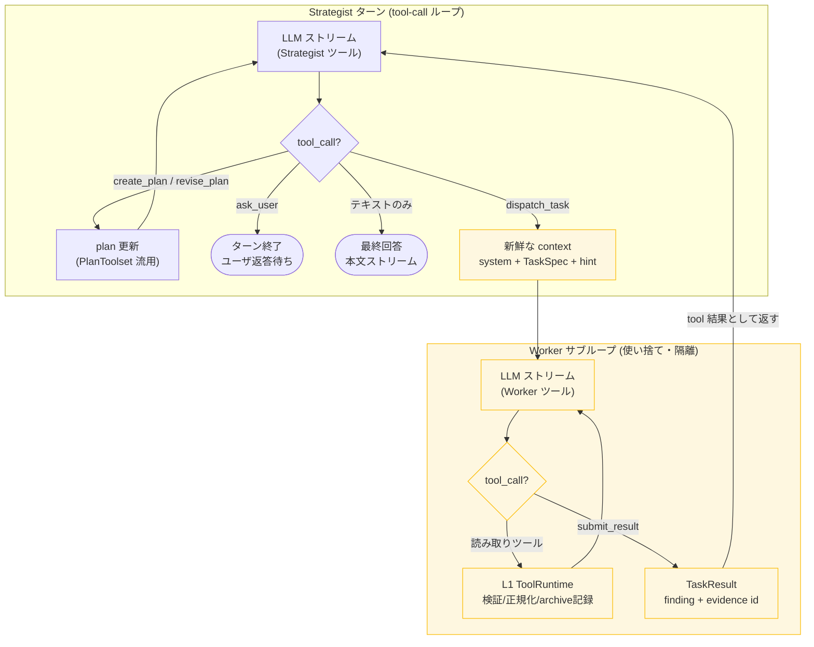

**行動語彙 (各層に渡すツール定義)**

Strategist のツール (スレの生読み取りツールは渡さない):
- `create_plan(tasks[])` … 複雑系。各 task = `{id, goal, hint, limits}`
- `revise_plan(...)` … タスク追加 / 置換 / 削除
- `dispatch_task(id?, goal, contextHint, limits)` … Worker 起動 → `TaskResult{status, finding, evidence_ids, toolCallsUsed}` を tool 結果として返す。plan タスク (id 指定) でも ad-hoc (plan 無し) でも呼べる
- `ask_user(message)` … ターンを止めて確認 / 質問。次ターンで再開
- `recall_archive(id)` … finding の `evidenceIds` から**原文を id 指定で引く** (最終回答の逐語引用用)。`list_archive` (全件探索) は持たせない
- 最終回答 = ツール呼び出しなしの本文テキスト = ターン終端 (本文ストリームへ)

Worker のツール:
- 既存のスレ / 横断 / 開く 等の読み取り系をそのまま再利用
- `recall_archive(id)` … **contextHint で渡された id に限り** recall 可。`list_archive` (session 全体の探索) は**持たせない** (タスク隔離 D2 を守る)
- `submit_result(status, finding, evidence_ids)` … 終端ツール。これが `TaskResult` を生む
- plan 系 / `dispatch_task` / `ask_user` は持たない

**orchestration ループ (engine コード)**
- **Strategist ターン**: Strategist ツールセットで LLM をストリーム → tool_call を判定
  - `create_plan` / `revise_plan` → plan 更新 (既存 `PlanToolset` 流用)
  - `dispatch_task` → 新鮮な Worker コンテキスト (system + TaskSpec + contextHint) で Worker サブループを `submit_result` まで回し、finding / evidence を保存して `TaskResult` JSON を tool 結果で返す
  - `ask_user` → ターン終了 (次のユーザ送信待ち)
  - テキストのみ応答 → 最終回答として終端
- **Worker サブループ**: Worker ツールセットで LLM をストリーム → tool_call を L1 ToolRuntime で実行 (検証 / 正規化 / archive 記録 / id) → 正規化結果を積んでループ → `submit_result` で終了。`limits` (ツール予算 + 最大ステップ) 超過で強制 partial

**この構造から自然に落ちてくるもの**
- **並列 (D7)**: OpenAI 互換は 1 アシスタントメッセージで複数 tool_call を返せる。Strategist が 1 ターンで `dispatch_task` を複数並べる = 並列 Worker。並列トグル ON なら engine が同時実行 (`Task.WhenAll`)、OFF なら逐次。
- **fast-path (E4)**: 初手で `create_plan` を呼ばず `dispatch_task` 1 本 (or 本文即答) = plan 省略の fast-path。専用機構は不要。
- **リトライ (D9)**: 同一 task id への `dispatch_task` 再呼び出しを engine が試行回数カウント。上限で failed 確定。

**終端の堅牢性**: reasoning モデルが `submit_result` を呼び忘れてテキストだけ返す場合に備え、「ツールなしテキスト = status:done の finding とみなす」寛容フォールバックを入れる (現行 think-only 問題の再発防止)。

**complete_task の扱い**: finding は Worker から来るため、現行の「Strategist が finding を書く complete_task」は不要。タスク受理は「Strategist が次へ進む」ことで暗黙成立 (明示マークを UI 進捗用に残すかは E6 で判断)。

### 4.6 heavy 確認フロー (D11 詳細)

旧来の **承諾分類器 (`ClassifyAsApprovalAsync`) と `estimate_and_confirm` ツールをともに廃止**する。

**① 承諾分類器の廃止**
旧分類器は「直前に heavy 確認を出した」文脈を判断点に持てない旧単一ループの継ぎ接ぎだった。新エンジンでは Strategist 会話がターンを跨いで永続する (D8) ため、`ask_user` で出した確認文も、それへのユーザ返答も同じ会話に残る。承諾 / 拒否の解釈は Strategist の通常のターン処理に吸収され、別 LLM 呼びの分類器は不要になる。

**② heavy 判定は plan の宣言 `limits` から engine が算出**
estimate を独立ツールにせず、`create_plan` / `revise_plan` の tool 結果に判定を畳み込む。
- light → 「proceed (dispatch してよい)」
- heavy → 「HEAVY (理由: …)。dispatch 前に必ず `ask_user` で A/B/C 確認を取れ」

判定閾値は現行踏襲: **合計ツール予算 ≥ 12 / いずれかのタスクが all_boards / いずれかが full-thread 読み**。総量基準なので並列 (D7) でも有効。`revise_plan` でも再評価する (実行中に plan が膨らむケースをカバー)。

**fast-path 抜け穴の封じ**: heavy 判定は plan 宣言時 (`create_plan`/`revise_plan`) **だけでなく、アクティブ依頼の累積コミット予算 (Σ dispatched + planned `maxToolCalls`) でも評価**する。plan を立てず ad-hoc `dispatch_task` を多数並べても、累積が閾値を超えた時点で次の `dispatch_task` をゲートし `ask_user` を強制する (= fast-path 経由のコスト制御漏れを塞ぐ)。累積カウンタはアクティブ依頼単位で持ち、新規依頼 (`create_plan` 置換 / 話題転換) でリセットする (D13)。

**③ heavy ゲート (決定論バックストップ)**
heavy 未確認の間、engine は `dispatch_task` を error tool 結果でブロックする (現行 `EstimateRequired` ガードの移植)。plan 由来の heavy か累積予算超過かを問わず同じゲートで止める。
- 解除条件 = 「heavy 確認の `ask_user` を出し、ユーザ返答ターンが来た」。
- 承諾 / 拒否の**意味**はゲートでは判定しない (Strategist の仕事 = 拒否なら revise、承諾なら dispatch)。

**④ A/B/C の文面は Strategist が構成**
engine は `heavy_reasons` と (任意で) 軽量化ヒント・雛形文字列を返すのみ。Strategist が plan を踏まえて `ask_user` で A実施 / B軽量 / C別案 を提示する (テンプレ強制ではなく system prompt の規約)。

**⑤ 申告整合 (副次効果)**
各タスクの `limits.maxToolCalls` は予算 (上限キャップ)。ゲート回避目的で過少申告すると Worker がそのキャップで打ち切られ partial になり、自分のタスク完遂が損なわれる。よって正直申告のインセンティブが働く (旧 `estimated_tool_calls` の自己申告にはこの強制力がなかった)。

### 4.7 `limits` / 層間コントラクト確定 (D12 詳細)

§2.3 の `TaskSpec` / `TaskResult` / `ToolOutput` を実体化する。

**`limits` の 3 フィールド** (per-タスク):

| フィールド | 型 | 役割 | 旧 estimate との対応 |
|---|---|---|---|
| `maxToolCalls` | int | **Worker のツール予算 (ハード上限)**。超過で打ち切り → partial | `estimated_tool_calls` (自己申告 → **強制キャップ**に格上げ) |
| `scanBreadth` | enum | `single` / `few` / `many` / `all_boards`。横断幅 | `scan_breadth` (踏襲) |
| `readsFullThread` | bool | スレ全読みか | `reads_full_thread` (踏襲) |

- **役割の区別**: `maxToolCalls` は実行時の決定論キャップ (Worker を物理的に縛る)。`scanBreadth` / `readsFullThread` は heavy 判定の記述子 + Worker への指針 (実行時の縛りは主に `maxToolCalls` 経由)。
- **heavy 集計 (D11 と接続)**: `Σ task.maxToolCalls ≥ 12` / `any task.scanBreadth == all_boards` / `any task.readsFullThread` のいずれかで heavy 判定。集計は plan 宣言分だけでなく **ad-hoc `dispatch_task` も含めたアクティブ依頼の累積**で行う (fast-path 抜け穴対策・§4.6)。
- **予算枯渇のグレースフル処理**: Worker が `maxToolCalls` に達したら engine が最後のステップで「予算上限。今ある情報で `submit_result(partial)` せよ」を注入。呼ばなければ engine が収集済み情報から partial を合成 (= 必ず止まり、必ず finding が返る)。
- **省略時デフォルト**: Strategist が `limits` を省略 (特に fast-path の ad-hoc タスク) したら `maxToolCalls=6 / scanBreadth=single / readsFullThread=false` (= light 確定) を engine が適用。
- **ドロップする旧フィールド**: `plan_summary` (= タスク goal 群で代替) / `lighter_alternative` (= D11 で Strategist が `ask_user` に構成)。
- **(将来拡張・コア外)**: `limits.allowedTools` でタスク単位にツールを絞る案。コア最小では入れない。

**確定したコントラクト**:

```
TaskSpec   { id, goal, contextHint, limits{ maxToolCalls, scanBreadth, readsFullThread } }
TaskResult { id, status(done|partial|failed), finding, evidenceIds[], toolCallsUsed }
ToolOutput { ok, normalizedResult | structuredError, archiveId }   // archiveId は D5: L1 が記録して返す
```

### 4.8 plan ライフサイクル / 新規リクエスト検出 (D13 詳細)

**専用の新規リクエスト検出器は持たない** (D11 で承諾分類器を消したのと同じ原理)。永続 Strategist 会話 (D8) があるため、Strategist は新ターンが継続か新規かを文脈で判断し、それを **どのツールを呼ぶか** で表明する。

| Strategist の初手 | 意味 | plan への作用 |
|---|---|---|
| `create_plan` | 新規の構造的依頼 | **plan 置換** (タスク総入れ替え) |
| `revise_plan` | 既存 plan の継続・拡張 | タスク追加 / 修正 |
| `dispatch_task` (plan 無し) | 軽い継続 or 単純新規 | plan 変更なし (fast-path) |
| テキスト即答 | タスク不要の些末 | なし |

既存 `PlanToolset` が `create_plan` = 置換 (`_tasks.Clear()`) / `revise_plan` = マージの意味を既に持つため語彙はそのまま流用。

**plan ライフサイクル**: `active` (未完タスクあり / 実行中) → `completed` (全タスク done・最終回答済)。
- engine は plan をターンを跨いで保持し続ける (自動リセットしない)。完了 plan も `completed` として文脈に残す。
- `create_plan` (置換) 時に engine が **plan スコープ状態をリセット**: タスク一覧 / D9 のリトライカウンタ / D11 の heavy ゲート flag / D11 の累積コミット予算カウンタ。heavy は新 plan の `limits` で再評価。

**重要ルール — plan 置換 ≠ 記憶消去**: `create_plan` が置換するのはタスク一覧だけ。finding / archive / 会話はセッションスコープ (D8) なので残る (直近はライブ文脈、古いものは archive を id で recall)。よって新 plan を立てた後でも前の finding を参照する継続が成立する (置換するのは*計画の構造*であって*記憶*ではない)。

**一時停止 (`ask_user`) からの復帰**: `ask_user` で止まった plan は active のまま一時停止。次のユーザ送信は基本「その返答」= 継続 (D11 で Strategist が解釈)。話題転換なら Strategist が新 plan を立て保留 plan を捨てる (Strategist の判断)。

**system prompt の規約**: 「新メッセージが現 plan の継続 / 精緻化なら `revise_plan` か `dispatch_task`、明確に別件なら `create_plan` (置換される)。過去 finding は plan 置換後も参照可能」と明記。決定論で縛るのは plan スコープ状態のリセットのみ、意味判断は Strategist に委ねる。

### 4.9 表示マッピングとエラー提示 (D14 / D15 詳細)

E6 (表示) / E7 (エラー) はともに `IAgentHost` (§5.2) を介すのでここで契約を確定する。

**表示マッピング (D14)**

| エンジンのイベント | host メソッド | 表示位置 |
|---|---|---|
| Strategist の plan レベル語り | `StreamWork` | 折りたたみ作業エリア (区画外) |
| `create_plan` / `revise_plan` | `PlanUpdated` | 作業エリア先頭のチェックリスト (N/M 完了が動的更新) |
| `dispatch_task` 開始 | `BeginWorkSection(goal)` | 新しい区画 (並列なら複数同時) |
| Worker の思考 / 語り | `section.Stream` | 区画内 (折りたたみ) |
| Worker の tool 呼び出し | `section.ToolMarker` | 区画内 |
| Worker `submit_result` | `section.Complete(status, finding)` | 区画見出しに finding |
| `ask_user` | `StreamBody` + `End` | 本文 (可視)・ターン終了 |
| 最終回答 | `StreamBody` + `End` | 本文 (可視) |
| 進捗 | `Status` | 1 行ステータス (`[計画 2/5] …`) |

**境界の確定化 (旧 speculative boundary の廃止)**: 旧コードは最終回答がどのラウンドか予測できず `agentFinalBoundary` を投機セット → 巻き戻ししていた。新エンジンは engine が「今は work / 今は最終回答」を確定的に知るため、**最初の `StreamBody` 呼び出し = work↔body 境界**で済む (投機・巻き戻し不要)。Strategist の `<think>` は表示しない (plan / 区画 / Status が可視の代弁)。

**エラー提示 (D15)**

原則: **`Error()` (赤・ターン中断) は「エージェントが推論で扱えない基盤障害」だけ。エージェントが対処できる失敗 (tool エラー・タスク失敗) は作業ログに残し、Strategist が本文で要約する** (= 最下層で扱える所で扱う層思想の UX 版)。

| 種別 | 扱い | 表示 |
|---|---|---|
| tool エラー (回復可能) | Worker が ReAct で自己修正 (D9 戦術) | `section.ToolMarker(failed:true)` (区画内)。`Error()` は出さない |
| task partial / failed | Strategist が finding を見て対処 (D9 戦略) | `section.Complete(partial/failed, finding)` + Strategist が本文で影響を要約 |
| Worker の LLM 呼び出し失敗 | failed TaskResult に変換して Strategist に処理させる | 区画 `Complete(failed)`。致命的な設定 / 認証エラーなら `Error()` + 中断 |
| Strategist の LLM 呼び出し失敗 | 上位がいないので回復不能 | `Error()` + ターン中断 |
| キャンセル (D6・閉じる / 停止) | エラーではない | `Notice("中断しました")` で穏当終了。実施済み区画は残す。赤は出さない |

---

## 5. エンジン差し替えの seam

両エンジンが **同じツール土台と UI 出力先を共有し、Agent 本体だけ差し替わる**。差し替え点を 1 本のインタフェースに集約する。

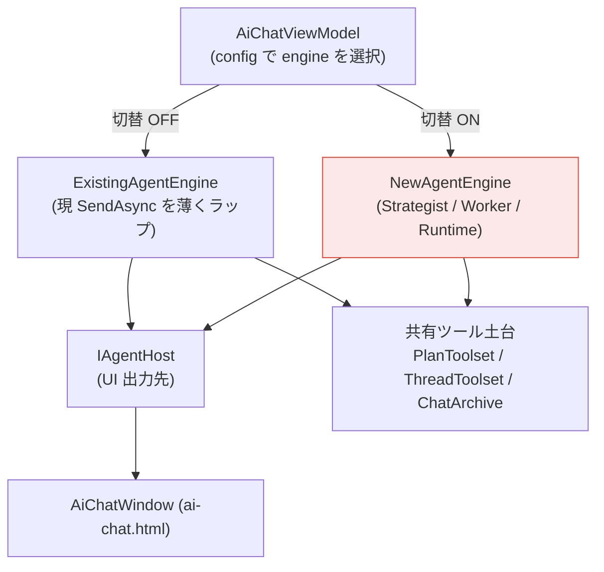

### 5.1 IAgentEngine — 差し替え単位

```csharp
interface IAgentEngine
{
    // 1 ユーザ送信を処理。中断は ct。
    Task RunTurnAsync(string userText, CancellationToken ct);
}
```

UI 出力先 (`IAgentHost`) と共有ツール土台 (`AgentToolContext`) はセッション内で不変なので、
per-call ではなく**各エンジンのコンストラクタで注入**する (B0 実装で確定)。

- **ExistingAgentEngine** … 既存の単一ループ本体 (`AiChatViewModel.RunLegacyTurnAsync`) を委譲で包むだけ (中身は不変)。ループ本体は VM 内に残し移動しない。これにより以降の新エンジン作業が既存に一切触れない。
- **NewAgentEngine** … 本資料 §2 の 3 レイヤーをゼロから実装。host / ctx を ctor で受け取る。

### 5.2 IAgentHost — UI 出力契約 (D4 の答え)

「本文 / 作業ログ」の二系統に分け、低レベルな displayBuffer・最終回答境界の機構を host 側に閉じ込める。エンジンは「何を表に出すか」だけ考えればよい。確定契約 (表示・エラーの割り当ては D14 / D15 = §4.9):

```csharp
interface IAgentHost
{
    void Begin();
    void StreamWork(string deltaMd);                  // Strategist の plan レベル語り (区画外・折りたたみ)
    IWorkSection BeginWorkSection(string title);      // dispatch_task 1 件 = 区画 (並列で複数可)
    void PlanUpdated(PlanView plan);                  // plan チェックリストの作成 / 更新
    void StreamBody(string deltaMd);                  // 最終回答 / ask_user (可視本文・初回呼出で境界確定)
    void Status(string text);                         // 1 行ステータス
    void Notice(string text);                         // 非致命の注記 (中断 / 一部失敗) — 黄系
    void Error(string text);                          // 致命 (Strategist LLM 失敗 / 設定エラー) — 赤・中断
    void End();
}

interface IWorkSection            // Worker は自分の区画にだけ書く
{
    void Stream(string deltaMd);                      // Worker の思考 / 語り (区画内)
    void ToolMarker(string label, bool failed);       // ツール呼び出し (failed=回復した tool エラー)
    void Complete(TaskStatus status, string finding); // done/partial/failed + finding を見出しへ
}
```

逐次でも並列でも同じ契約で動く。並列時は区画が増えるだけでログが混ざらない。`MarkdownRenderer` は区画ごとのストリームに流用する。

### 5.3 AgentToolContext — 共有ツール土台

既存 Toolset (`PlanToolset` / `ThreadToolset` / `ChatArchive`) をまとめて渡す。新エンジンの L1 ランタイムはこれを **検証・正規化・archive 記録 (id 返却)** で包み、Worker には正規化結果と archive id だけを返す (D5)。`ChatArchive` は並列 Worker から同時追記されるため **id 採番をロックしてスレッドセーフ化**する。

---

## 6. 設定スキーマ

`AppConfig` に additive で追加する (既存 `Llm*` はそのまま温存)。

| 設定 | 型 | 内容 | 既定 |
|---|---|---|---|
| 新 AI エージェントを使う | bool | 既存 ⇄ 新の切替トグル | OFF (完成まで) |
| Strategist 接続 | URL / Key / Model / Context | 戦略層の LLM 接続 (フルセット) | — |
| Worker 接続 | URL / Key / Model / Context | 実行層の LLM 接続 (フルセット・別接続可) | — |
| 並列実行を許可 | bool | ON=複数 Worker 同時 / OFF=逐次 | OFF (安全側) |

**並列トグルの根拠**: 2 接続を同一ローカル llama.cpp に向けると並列要求は競合するため逐次が良い。別マシン / 別エンドポイントに分ければ並列が効く。接続トポロジは利用者しか知らないので、設計側で決め打ちせずトグルで委ねる。Strategist / Worker がそれぞれフル接続なので「賢いモデルはクラウド、Worker はローカル」のような混在構成も可能。

設定 UI への配線は実績ある経路を流用: `AppConfig` → `SettingsViewModel` (`[ObservableProperty]` + 300ms debounce) → 設定パネル + `ApplyConfig` コールバック。

---

## 7. 構築方針 (並走 + 切替)

旧「段階リファクタ」(単一ループを少しずつ分解) は破棄。新エンジンは切替トグル (既定 OFF) の裏で **ゼロから構築**し、各段階で「既存は常に動く / 新は OFF の裏で育つ」を保つ。

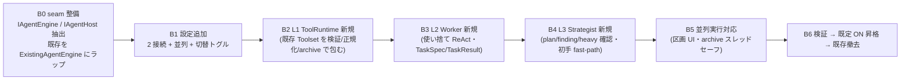

- **B0** で既存をインタフェース化しておけば、以降の新エンジン作業は既存コードに一切触れない。
- 逐次フロー (§2.4) をまず B4 までで成立させ、並列 (D7) は B5 で被せる (= 区画 UI と archive のスレッドセーフ化が揃ってから)。
- **B6** で十分検証できたら既定を新エンジンへ切替、最終的に既存エンジンを撤去する。

**進捗**:
- ✅ **B0 完了 (2026-05-23)** — `Services/Agent/` に `IAgentEngine` / `IAgentHost` / `IWorkSection` / `AgentToolContext` と契約型 (`TaskSpec` / `TaskResult` / `Limits` / `ToolOutput` / `ScanBreadth` / `TaskOutcome`) を新設。既存ループ本体を `AiChatViewModel.RunLegacyTurnAsync` に切り出し `ExistingAgentEngine` で委譲ラップ。`SendAsync` は入力取り出し → `_engine.RunTurnAsync` に薄化。ビルド 0 警告 / 0 エラー・既存挙動不変。
- ⬜ B1 設定追加 (2 接続 + 並列 + 切替トグル) — 次。

---

*最終更新: 2026-05-23 / 設計確定 (D1〜D15 + 実装前レビュー反映) + 実装着手 B0 完了 (seam 抽出・既存ループの ExistingAgentEngine 化)*
